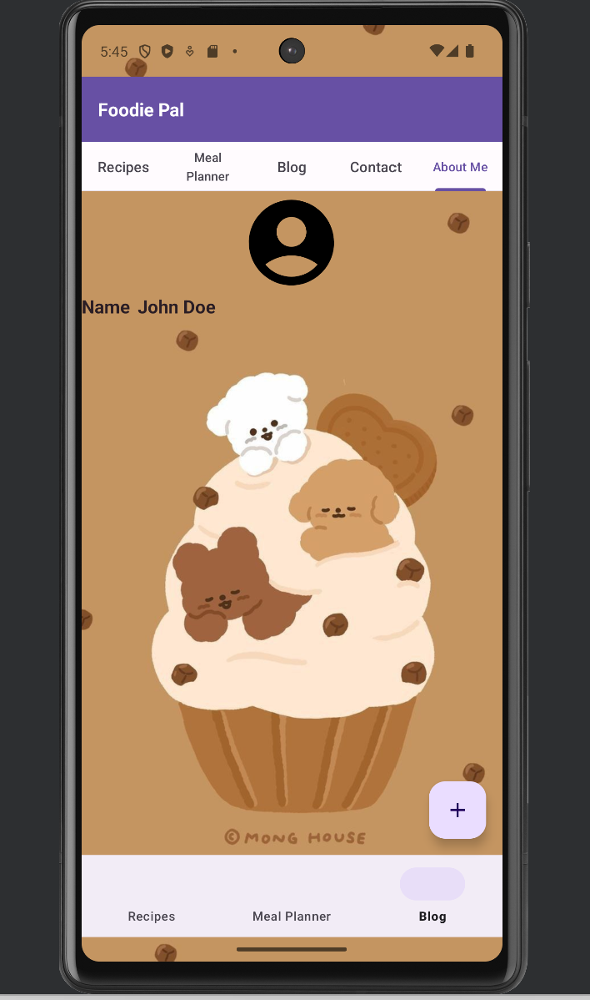

# Foodie Pal

Brief description or introduction to your project.

## Table of Contents

- [Description](#description)
- [Installation & Running](#installation)
- [Screenshots](#screenshots)

## Description

This is a project developed as part of the submission for `CS473DE: Mobile Device Programming` course. This application supports android devices starting Android 7.0 (API level 24) to the latest Android 14 (API Level 34).

## Installation

- Clone the project
- Open it in your local IDE (Android Studio, IntelliJ)
- Install the dependencies and run the project using your android emulator or connected device.
- To login you can use the users listed in [users](app/src/main/res/values/users.xml)

## Screenshots

Some of the screens of the application are:

### Login

### Recipes

### Meal Planner

### Blog

### Contact

### About me

